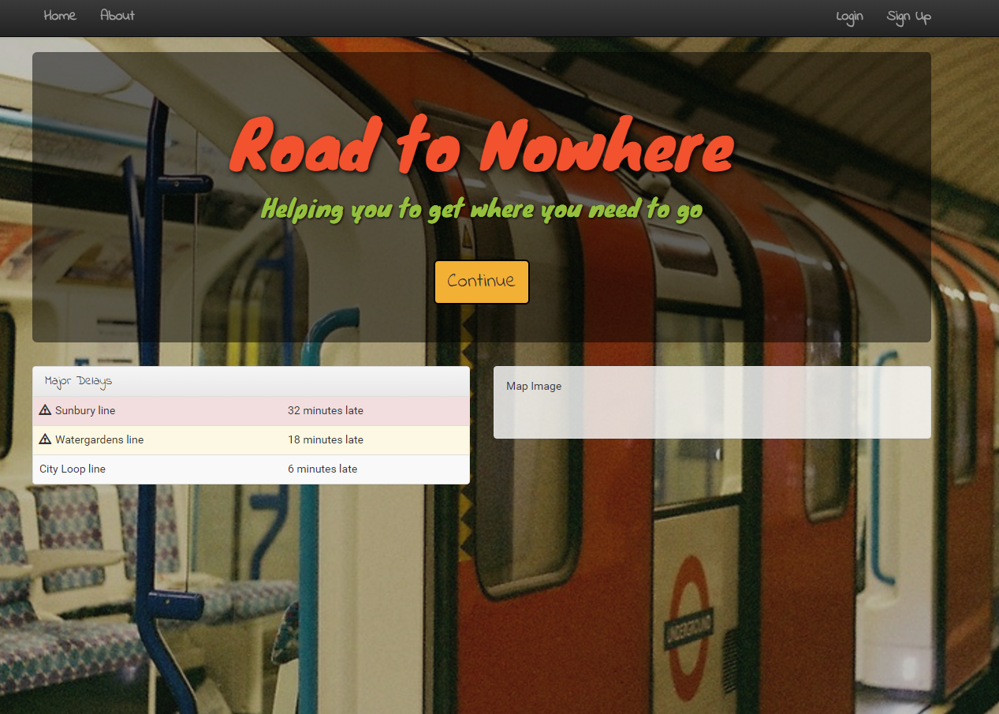
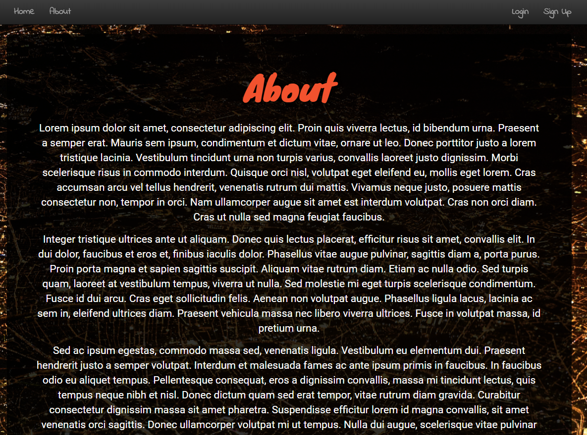

# Road to Nowhere - Week 5

This week we had to create a static webpage for our transport site.  The page we chose to create the static mockup of, was naturally our homepage. We also have a few other tentative powerpoint mockups of additional pages the site contains. 

As shown in the mock-up from last week, our static home page contains a navigation bar as well as a notification system for the major delays on certain lines, however there is only a couple njotifications at the current moment as placeholders. We decided to stay with  our original font choice as it helps convey the convenience and inevitable calmness of knowing whats going on around you relative to transport issues.

Another mockup static page which was created was the About page, which we are intending to have communicate to potential users the benefits of using our system over the standard ptv counterparts.

INSERT LINK TO WEBPAGE HERE

We have a couple mockups above for other possible pages our site may contain, hoewever these are still a work in progress and in no way final.

Comment on mockups
